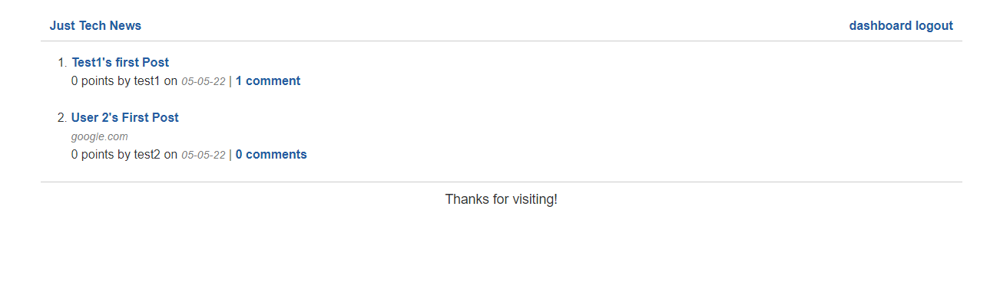

# tech-news-java-api
---

  
  
   
   
   
   
## Description

This is a re-write of the Technews App I had previously written to use a Java backend.

---
  ## Table of Contents

  [Features](#features)

  [Screenshot](#screenshot)
    
  [License](#license)

  [Questions](#questions)
  
  

---

## Features

      1. Written with Java's Spring Framework. 
---

## Screenshot 
  
  
  

  ---
  ## License 

  &emsp; 

      To read about the license of this project click the link below.

  &emsp;[License](https://github.com/tgtiburon/tech-news-java-api/blob/main/LICENSE) 

---
## Questions

If you have any questions about this project feel free to email me at <tg.tiburon@gmail.com>.  

To see the rest of my portfolio, visit [Github](https://github.com/tgtiburon).

Below is a graphic displaying my most used languages on github.

This Readme file was created with Readme Architect by Tony Gendreau &copy;
